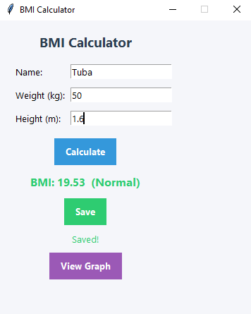

# BMI Calculator (Advanced Tier)

## Description
A desktop BMI (Body Mass Index) Calculator built with Python and tkinter. Users enter their name, weight, and height to calculate their BMI, view a color-coded health category, save their result to a personal history, and visualize their BMI trend over time using a graph.

This project was built as part of the Oasis Infobyte Summer Internship Program (OIBSIP) — Python Programming track, Task 2.

## Tech Stack
- **Python 3**
- **tkinter** — GUI
- **SQLite3** — local database for storing user history
- **matplotlib** — BMI trend graph visualization

## Features
- Calculate BMI from weight (kg) and height (m)
- Input validation — rejects non-numeric, negative, zero, and unrealistic values
- Color-coded results:
  - Blue — Underweight
  - Green — Normal
  - Orange — Overweight
  - Red — Obese
- Multi-user support — records are saved per name
- Save calculated results to a local SQLite database
- View a BMI trend graph (line chart) of a user's saved history over time
- Graceful error handling for invalid input, empty fields, missing history, and database read/write failures

## Project Structure
```
Python-Task2-BMICalculator/
├── main.py
├── bmi_logic.py
├── database.py
├── gui.py
├── chart.py
├── README.md
├── .gitignore
└── screenshot.png
```

## How to Run
1. Make sure Python 3 is installed.
2. Install the required package:
   ```
   pip install matplotlib
   ```
   (tkinter and sqlite3 come built-in with Python.)
3. Navigate to the project folder:
   ```
   cd Python-Task2-BMICalculator
   ```
4. Run the app:
   ```
   python main.py
   ```
5. Enter your name, weight (kg), and height (m), then click **Calculate**.
6. Click **Save** to store the result, or **View Graph** to see your BMI trend over time.

## Screenshot


## Author
Tuba Shakeel