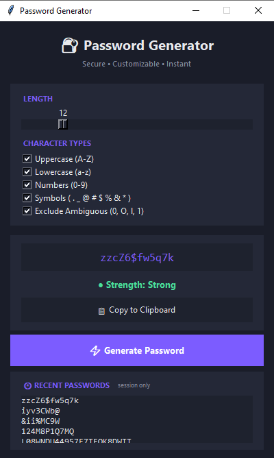

# Random Password Generator (Advanced Tier)

**OIBSIP — Python Programming Internship — Task 3**

A secure, GUI-based random password generator built with Python and `tkinter`, using the cryptographically secure `secrets` module instead of `random`. Built as part of the Oasis Infobyte Python Internship (Advanced tier).

## Overview

This tool lets a user generate strong, customizable passwords through a simple desktop GUI. Users control password length, which character types to include, and whether to exclude visually ambiguous characters. Every generated password is guaranteed to include at least one character from each selected type, is automatically copied to the clipboard, and is scored with a Weak/Medium/Strong strength rating. The last 5 passwords generated in a session are shown in a temporary, in-memory history.

## Features

- **Adjustable length** — slider-controlled, 8 to 32 characters (minimum of 8 enforced)
- **Character type selection** — Uppercase, Lowercase, Numbers, Symbols (checkboxes; at least 2 types required)
- **Restricted symbol set** — a curated set (`. _ @ # $ % & *`) instead of full punctuation, for readability
- **Guaranteed character coverage** — every selected type is guaranteed to appear at least once in the output (not left to random chance)
- **Ambiguous character exclusion** — optional toggle to remove visually confusable characters (`0`, `O`, `l`, `1`)
- **Cryptographically secure generation** — uses Python's `secrets` module, not `random`
- **Strength indicator** — Weak / Medium / Strong, based on a length + character-diversity scoring system, with the label color-coded (red for Weak, orange for Medium, green for Strong) for an at-a-glance read
- **Clipboard integration** — automatic copy on generation, plus a manual "Copy to Clipboard" button
- **Session history** — displays the last 5 generated passwords (in-memory only, cleared when the app closes)
- **Input validation** — clear error messages for invalid length, insufficient character types, and (as a safety net) ambiguous-exclusion leaving too few characters
- **Generate another** — regenerate freely without restarting the app

## Tech Stack

- **Python 3.13**
- **tkinter** — GUI (sliders, checkboxes, buttons, entry, listbox)
- **secrets** — cryptographically secure random character selection
- **string** — base character sets (letters, digits)
- **pyperclip** — cross-platform clipboard access

## Security Design Notes

A few deliberate design decisions worth calling out:

- **`secrets` over `random`** — Python's `random` module uses a Mersenne Twister PRNG, which is deterministic and can be reverse-engineered from as few as 624 observed outputs, making all future outputs predictable. `secrets` instead draws from the operating system's cryptographically secure random source, making it unsuitable to reconstruct or predict — the correct choice for anything security-sensitive, like passwords.
- **Guaranteed type coverage without bias** — rather than trusting that a long enough random draw will *probably* include every selected character type, this generator deliberately places one guaranteed character from each selected type first, fills the remaining length randomly from the combined pool, and then shuffles the full result. This avoids a failure mode observed during development, where a purely random draw could silently omit a selected character type.
- **Custom Fisher-Yates shuffle** — `secrets` intentionally does not provide a `shuffle()` function, to avoid a naive, potentially biased implementation being used in a security-sensitive context. This project implements a manual Fisher-Yates shuffle using `secrets.randbelow()`, ensuring the guaranteed-coverage characters aren't predictably clustered at the start of the password.

## How to Run

1. Make sure Python 3 is installed.
2. Install the one external dependency:
   ```
   pip install pyperclip
   ```
3. From the project folder, run:
   ```
   python password_generator.py
   ```
4. Set your desired length, character types, and options, then click **Generate Password**.

## Folder Structure

```
Python-Task3-PasswordGenerator/
├── core.py                  # Core logic: validation, generation, strength scoring
├── password_generator.py    # tkinter GUI, wired to core.py
├── README.md
└── screenshot.png
```

`core.py` and `password_generator.py` are deliberately separated: `core.py` contains no GUI code and can be tested independently from the console, while `password_generator.py` only handles presentation and user interaction, calling into `core.py` for all logic.

## Validation Rules / Edge Cases Handled

- Password length below 8 → blocked with an error message
- Fewer than 2 character types selected → blocked with an error message
- Ambiguous-character exclusion leaving too few available characters for the requested length → blocked with an error message (not reachable with the current character sets and length range, but validated defensively in case those sets change in the future)

## Screenshot



## What I Learned

Building this project taught me the difference between code that just "works" and code that's actually safe to use. I started out using `random` for generation, and it wasn't until I learned how predictable it really is — its internal state can be reconstructed from just a few hundred outputs — that I understood why `secrets` exists as a separate module in Python. That was the biggest mental shift in this project: realizing "random" and "secure" aren't the same thing.

I also learned to actually test assumptions instead of trusting my code just because it read correctly. When I ran my first version of the generator several times in a row, some outputs were silently missing a character type I had selected — something I wouldn't have caught just by reading the code. Fixing that (guaranteeing one character from each selected type, then shuffling everything with a manual Fisher-Yates shuffle, since `secrets` doesn't provide a built-in shuffle function) taught me that "looks correct" and "is correct" are two different things, and that real test runs matter.

On the GUI side, I got more comfortable with `tkinter` patterns beyond what I'd used before — binding `BooleanVar`/`IntVar` to widgets and reading them fresh only when a button is clicked (not caching values too early), and handling a read-only `Entry` widget that still needs to be updated from code. I also practiced structuring the project with a clear separation between logic (`core.py`) and interface (`password_generator.py`), which made it possible to test the generation logic on its own from the console before ever touching the GUI.

## Author

**Tuba Shakeel**
Python Programming Intern — Oasis Infobyte
[LinkedIn](https://www.linkedin.com/in/tuba-shakeel-459091310) | [GitHub](https://github.com/tubashakeel67-ai)